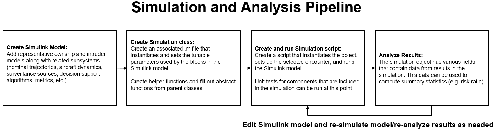
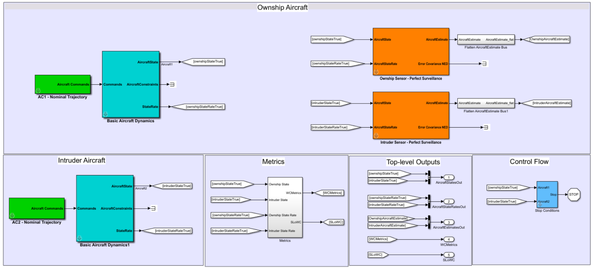
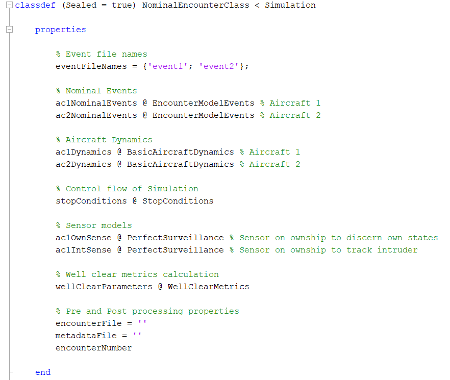
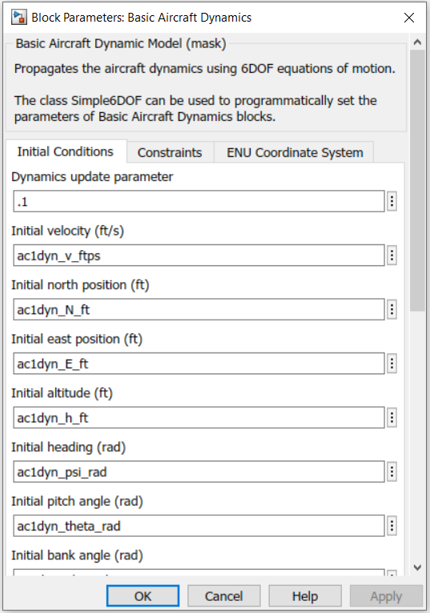
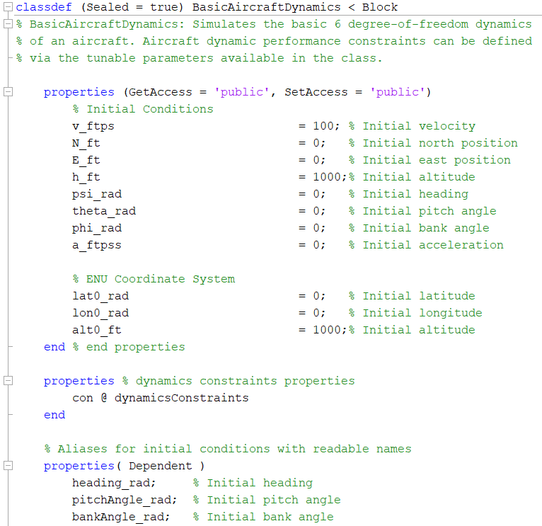
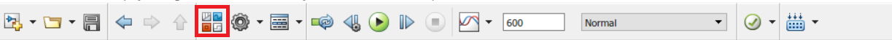
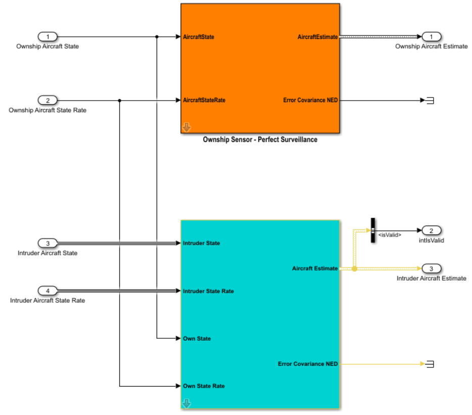

# DAA Evaluation of Guidance, Alerting, and Surveillance

The DAA Evaluation of Guidance, Alerting, and Surveillance (DEGAS) repository contains a simulation framework created by MIT LL to perform simulations of Detect and Avoid (DAA) Systems. DEGAS can be used to create an end-to-end simulation of typically two aircraft using MATLAB/Simulink. The code directory contains all of the components required for a user to create a two aircraft nominal encounter. A nominal encounter is an encounter where no avoidance maneuvers are performed by either aircraft. The DEGAS simulation pipeline is consistent with the Monte Carlo process described in this [paper](https://apps.dtic.mil/dtic/tr/fulltext/u2/a474336.pdf). There are additional repositories available that can be used to increase DEGAS functionality, for example, acquiring the [`DAIDALUS`](https://github.com/nasa/daidalus/tree/DAIDALUSv2.0.1c) (a NASA DAA alerting and guidance implementation) repository can allow the ownship to perform DAA maneuvers.

- [DAA Evaluation of Guidance, Alerting, and Surveillance](#daa-evaluation-of-guidance-alerting-and-surveillance)
  - [Nomenclature](#nomenclature)
  - [Prerequisites](#prerequisites)
  - [Overview of the simulation and analysis pipeline](#overview-of-the-simulation-and-analysis-pipeline)
    - [1) Create Simulink Model](#1-create-simulink-model)
      - [Ownship Aircraft](#ownship-aircraft)
      - [Intruder Aircraft](#intruder-aircraft)
      - [Metrics](#metrics)
      - [Top-Level Outputs](#top-level-outputs)
      - [Control Flow](#control-flow)
    - [2) Create Simulation class](#2-create-simulation-class)
    - [3) Create and run simulation script](#3-create-and-run-simulation-script)
    - [4) Analyze results](#4-analyze-results)
  - [DEGAS directories](#degas-directories)
  - [Quick Start and Nominal Encounter Run](#quick-start-and-nominal-encounter-run)
  - [Setup for simulations that use DAIDALUS for Detect and Avoid](#setup-for-simulations-that-use-daidalus-for-detect-and-avoid)
  - [Testing and code validation](#testing-and-code-validation)
  - [Adding a new component to an end-to-end simulation](#adding-a-new-component-to-an-end-to-end-simulation)
  - [Monte Carlo simulation methodology](#monte-carlo-simulation-methodology)
  - [Potential Extensions](#potential-extensions)
  - [Current limitations](#current-limitations)
  - [Citation](#citation)
  - [Distribution Statement](#distribution-statement)

## Nomenclature

Acronym | Phrase
 :--- | :---
DAA | Detect and Avoid
DAIDALUS | [Detect and Avoid Alerting Logic for Unmanned Systems](https://github.com/nasa/daidalus/tree/DAIDALUSv2.0.1c)
DEGAS | DAA Evaluation of Guidance, Alerting, and Surveillance
HMD | Horizontal Miss Distance
NMAC | Near Mid-Air Collision (500 ft horizontally, 100 ft vertically)
VMD | Vertical Miss Distance

## Prerequisites

Code developed and tested in Windows and Unix for Matlab R2018b. Although not tested, we expect this software to be supported by newer versions of Matlab. In addition to MATLAB, access to Simulink from the same release of MATLAB is required.

**Note:** If a Simulink model or library is saved in a newer version of Matlab, it cannot be opened in an older version of Matlab unless it is properly exported.

## Overview of the simulation and analysis pipeline

*Simulation and Analysis Pipeline*

An end-to-end simulation in DEGAS is a collection of modular components. These components can come from standard Simulink libraries, Simulink Toolboxes, or custom user-made Simulink blocks. MIT LL has developed libraries of custom-made components that allow for the simulation of a two aircraft encounter, including dynamics and surveillance models. These components are located in `/degas-core/code/block_libraries/basic_libraries/`. Most components in that directory have both a Simulink model representation and a corresponding class that defines the properties and functions used by that component.

*Nominal Encounter Simulation*

The nominal encounter simulation shown above is `NominalEncounter.slx` and is located in `/degas-core/code/examples/NominalEncounter/`. The simulation and analysis pipeline is explained in more detail below.

**Note:** The DEGAS simulation and analysis pipeline makes extensive use of the object-oriented capabilities that MATLAB provides. The user can read and familiarize themselves with these capabilities [here](https://www.mathworks.com/discovery/object-oriented-programming.html).

### 1) Create Simulink Model

  The first step is to create a Simulink model that contains the necessary components to simulate a two aircraft encounter. In the nominal encounter example shown above, the simulation consists of an Ownship Aircraft, Intruder Aircraft, Metrics subsystem, Top-level Outputs, and Control Flow.

  <!-- * Ownship Aircraft: -->

#### Ownship Aircraft

  The Ownship Aircraft consists of a Nominal Trajectory Block, Basic Aircraft Dynamics Block, and two sensors: one to measure ownship states and one to measure intruder states. In the nominal encounter, both sensors are Perfect Surveillance Blocks. The ownship sensor is used to estimate ownship states and can be replaced with a block that simulates an inertial navigation system or similar if ownship state errors are desired. The intruder sensor block can be replaced with another sensor, for example the EOIR Parametric model block that exists in `/degas-core/code/block_libraries/basic_libraries/surveillanceLib/surveillanceLib.slx`.

  From the Ownship Aircraft, the signals ownshipStateTrue, ownshipStateRateTrue, OwnshipAircraftEstimate and IntruderAircraftEstimate are collected as Top-level Outputs.

  <!-- * Intruder Aircraft: -->

#### Intruder Aircraft

  The Intruder Aircraft consists of a Nominal Trajectory Block and a Basic Aircraft Dynamics block. The Intruder Aircraft is expected to travel along its nominal trajectory, although the intruder could also be equipped with sensors and an alerting and guidance algorithm.

  The signals IntruderStateTrue and IntruderStateRatesTrue are collected as Top-level Outputs.

  <!-- * Metrics: -->

#### Metrics

  The Metrics subsystem seen in the Nominal Encounter contains three metrics blocks. More can be added depending on the needs of the analysis. The metrics blocks can be found in `/degas-core/code/block_libraries/basic_libraries/metricsLib/metricsLib.slx`.

  <!-- * Top-level Outputs: -->

#### Top-Level Outputs

  Top-level Outputs are the main source for collecting signals of interest. Signals that connect to an out port on the top level of the end-to-end simulation can be accessed via the method `getSimulationOutput()`. For example if the end-to-end simulation object (`simObj`) is instantiated and simulated, the AircraftEstimates Top-Level Output can be accessed via the command `simObj.getSimulationOutput('AircraftEstimates')`.

  <!-- * Control Flow: -->

#### Control Flow

  The Control Flow area contains the Stop Conditions block which can be found in `/degas-core/code/block_libraries/basic_libraries/controlLib/controlLib.slx`.
  The Stop Conditions block is used to stop the simulation if the range and altitude difference between the ownship and intruder aircraft exceed certain, user-modifiable thresholds.

<!-- 2) Create Simulation class -->

### 2) Create Simulation class

   The simulation created in step one of the simulation and analysis pipeline needs an associated class file. The class file contains the properties and methods that are used by the simulation before, during, and after the simulation is run. The class file associated with `NominalEncounter.slx` is [NominalEncounterClass.m](./code/examples/NominalEncounter/NominalEncounterClass.m) and is located in `/degas-core/code/examples/NominalEncounter/`. Every end-to-end simulation class needs to be derived from the Simulation class located in `/degas-core/code/base_classes/` so that all the required methods and properties are available to the end-to-end simulation class.

*NominalEncounter end-to-end simulation class*

  The properties in the end-to-end simulation class are associated with library blocks or custom-made blocks that are used in the simulation. Most blocks in the standard DEGAS libraries have mask parameters that affect the execution of the block. To determine if a block has mask parameters, double click on the block in Simulink and a window will pop up describing the block's function. If there are any fields that should be made tunable, then the block class used by the mask must be added to the end-to-end simulation class as a property. A tunable parameter is a parameter used by a simulation that can be set at runtime. Using tunable parameters allows for a single compiled Simulink model to run with various configurations, for instance, with different surveillance systems. An example of a block that has no tunable parameters is the commonMetrics block located in `/degas-core/block_libraries/basic_libraries/metricsLib/metricsLib.slx`. The commonMetrics block does not have any mask parameters so it does not need to be added to the end-to-end simulation class as a property.

  The image below shows the mask parameters for the Basic Aircraft Dynamics Block.

   *Mask for the Ownship Aircraft Basic Aircraft Dynamics Block*

   The fields that can be tuned are properties found in the [BasicAircraftDynamics.m](./code/block_libraries/basic_libraries/dynamicsLib/BasicAircraftDynamics/@BasicAircraftDynamics/BasicAircraftDynamics.m) file, shown below.

  [](./code/block_libraries/basic_libraries/dynamicsLib/BasicAircraftDynamics/@BasicAircraftDynamics/BasicAircraftDynamics.m)*The Basic Aircraft Dynamics Block class file*

  In the mask for the Ownship Aircraft Basic Aircraft Dynamics Block, the field "Initial velocity (ft/s)" is set to the parameter _ac1dyn_v_ftps_. In the Basic Aircraft Dynamics Block class file, this refers to the property _v_ftps_. The "ac1dyn_" prefix seen in the mask is set by the end-to-end simulation class constructor, as seen in the NominalEncounter end-to-end simulation class. Setting this prefix allows for the same block to be used multiple times with each instance of the block having unique parameters. The Basic Aircraft Dynamics Block is used twice in the NominalEncounter simulation: once to simulate the dynamics of the ownship and once to simulate the dynamics of the intruder.

  There are additional abstract methods that need to be defined, namely `isNominal()`, `getEventMatrices()`, and `setupEncounter()`. These are defined in `NominalEncounterClass.m` and can be used as a reference for the user's own end-to-end simulation class.

<!-- 3) Create and run simulation script -->

### 3) Create and run simulation script

  After the end-to-end Simulink simulation and simulation class are created, a simulation script can be created to set up and run the simulation object as desired. This is an optional step because the end-to-end simulation object can also be configured and executed from the MATLAB command line. While this step is optional, it is recommended so that the user can get familiar with the simulation and analysis pipeline. The simulation script for the NominalEncounter simulation is [RUN_NominalEncounter.m](./code/examples/NominalEncounter/RUN_NominalEncounter.m) and is located in the `/degas-core/code/examples/NominalEncounter/`. To execute the simulation, the user simply has to run the simulation script.

<!-- 4) Analyze results -->

### 4) Analyze results

To analyze the results from the simulation, there are various fields and methods that can be accessed. Below are some of the commands that can be used in scripts or in the MATLAB command line to access simulation results.

The `results`, `results_nominal`, and `estimates` fields are populated by the `onSimulationComplete()` method in [Simulation.m](./code/base_classes/Simulation/@Simulation/Simulation.m). Below are various commands that can retrieve or display analysis information.

``` octave
    >> s.results(1) % Get ownship results
    >> s.results(2) % Get intruder results
    >> s.results_nominal(1) % Get ownship nominal results
    >> s.results_nominal(2) % Get intruder nominal results
    >> s.estimates(1) % Get ownship state estimates via sensor/tracker readings
    >> s.estimates(2) % Get intruder state estimates via sensor/tracker readings
    >> s.plot % Plots various graphs of interest
    >> s.outcome % Get metrics of interest, such as NMAC, HMD, VMD, etc.

    % Get a logical vector that indicates the timesteps where Loss of Well Clear occurred. 'WCMetrics' is the name of a
    % Top-level Output that is connected to the Well Clear Metrics Block
    >> s.getSimulationOutput('WCMetrics')
```

## DEGAS directories

DEGAS contains a code directory that includes the following directories:

- base_classes: Contains classes that are indirectly used in an end-to-end simulation
- block_libraries: Contains Simulink blocks that can be used in end-to-end simulations
  - Each Simulink block has a corresponding wrapper class (with a few exceptions) and unit test that the user can run to verify that the block is operating correctly.
- examples: Contains example simulations and scripts that the user can execute to get familiar with the DEGAS workflow
- images: Contains images used by Markdown files
- integration_tests: Contains integration tests to ensure DEGAS is working as intended
- metrics_code: Contains code that allows the user to calculate metrics from collected aggregate results
- testing: Contains code that allows the user to run the unit test master script
- utilities: Helper functions used by various classes in DEGAS

## Quick Start and Nominal Encounter Run

After cloning this repository, follow these steps to setup DEGAS:

1) Startup MATLAB and change the current directory to the `/degas-core/code/` directory located where the repository was cloned.

2) Open the file `startup.m`. If there are additional paths that need to be added to the MATLAB path, they can be put into the `addThesePaths` cell variable. Currently the `addThesePaths` variable contains relative paths to the [degas-daidalus](https://github.com/mit-ll/degas-daidalus) and [degas-pilotmodel](https://github.com/mit-ll/degas-pilotmodel) repositories.  

3) Run `startup.m`. This will add all of the directories and files in the `/degas-core/code/` directory and `addThesePaths` variable to the MATLAB path.

   **Note:** `startup.m` should be run at the beginning of every MATLAB session where DEGAS will be used.

4) Change to the `/degas-core/code/examples/NominalEncounter/` directory and run [RUN_NominalEncounter.m](./code/examples/NominalEncounter/RUN_NominalEncounter.m).

5) If there are no errors, then DEGAS has been set up correctly.

## Setup for simulations that use DAIDALUS and the Pilot Model

The setup for simulations that use DAIDALUS for Detect and Avoid is intended to be run after all the steps in the Quick Start section have been completed.

1) Clone [degas-daidalus](https://github.com/mit-ll/degas-daidalus). Follow the instructions in the `README.md` file located in `/degas-daidalus/SimulinkInterface`. These instructions include obtaining NASA's [DAIDALUS v2.0.1](https://github.com/nasa/daidalus/tree/DAIDALUSv2.0.1c) and mexing the DAIDALUS s-function.

2) Clone [degas-pilotmodel](https://github.com/mit-ll/degas-pilotmodel).

3) Startup MATLAB and change the current directory to the `/degas-core/code/` directory located where the degas-core repository was cloned.

4) Open the file `startup.m`. Ensure the `addThesePaths` variable contains the correct paths to where you have cloned [degas-daidalus](https://github.com/mit-ll/degas-daidalus) and [degas-pilotmodel](https://github.com/mit-ll/degas-pilotmodel) repositories.

5) Change the working directory to `/degas-core/code/examples/DAAEncounter/`.

6) Run the script [RUN_DAAEncounter.m](./code/examples/DAAEncounter/RUN_DAAEncounter.m).

7) If there are no errors, then DAIDALUS and the SC-228 Pilot Model have been setup correctly.

8) Change the working directory to `/degas-core/code/integration_tests/`.

9) Run the script [RUN_integration_test_nom_daa](./code/integration_tests/RUN_integration_test_nom_daa.m). This script tests the `NominalEncounter.slx` and `DAAEncounter.slx` Simulink models to verify they are working as intended.

10) If there are no errors, then DEGAS, DAIDALUS, and the SC-228 Pilot Model have been integrated together correctly.

## Testing and code validation

To verify if the code and Simulink models contained in `/degas-core/code/block_libraries/basic_libraries/` are working as intended, the user can run `RUN_allUnitTests_script.m`, located in `/degas-core/code/testing/`. This script runs all of the unit tests located in `/degas-core/code/block_libraries/basic_libraries`. To verify if `NominalEncounter.slx` and `DAAEncounter.slx` are working as intended, the user can run `RUN_integration_test_nom_daa.slx`, located in `/degas-core/code/integration_tests/`. For more information, see the `README.md` files located in those directories.

## Adding a new component to an end-to-end simulation

Adding a new component to the simulation is straightforward. The user should be familiar with using Simulink. If not, there is a free Simulink on-ramp course provided by MathWorks that can be found [here](https://www.mathworks.com/learn/tutorials/simulink-onramp.html). Additional Simulink documentation can be found [here](https://www.mathworks.com/help/simulink/).

The steps below describe an example of how to replace the intruder sensor in the DAAEncounter with a block that represents an EOIR sensor.

1) Open `DAAEncounter.slx` located in `/degas-core/code/examples/DAAEncounter/`.

   **Note:** The Simulink model may have red-highlighted blocks if the variables that the block uses are not currently in the base workspace. These variables are added when the simulation is run by the `prepareSim` method.

2) In `DAAEncounter.slx`, navigate to the Surveillance Source subsystem.

3) In the Toolbar on the top of the window, open the Library Browser (this may take some time) and in the listed systems to the left, navigate into DEGASv1: Surveillance Library. The Library Browser symbol can be seen below for reference:

*The Library Browser symbol is outlined by the red square*

4) Navigate into the Surveillance subsystem in the Library Browser, right click on 'EOIR Parametric Model' and select 'Add block to model DAAEncounter/Surveillance Source' from the context menu.

5) In DAAEncounter/Surveillance Source, delete the 'Intruder Sensor - Perfect Surveillance' block from the simulation, and connect the appropriate inputs and outputs to the 'EOIR Parametric Model' block. A reference image is shown below:

*The EOIR Parametric Model in DAAEncounter/Surveillance Source*

6) Open `DAAEncounterClass.m` and in properties, and replace the lines:

``` octave
ac1IntSense @ PerfectSurveillance % Sensor on ownship to track intruder
```

with

``` octave
ac1IntSense @ EOIRParametricModel % Sensor on ownship to track intruder
```

and

``` octave
this.ac1IntSense = PerfectSurveillance('ac1IntPerfSurv_', 'surveillanceSampletime_s', this.uasSurveillance_sampleTime );
```

with

``` octave
this.ac1IntSense = EOIRParametricModel('ac1IntEOIR_');
```

7) Execute the script `RUN_DAAEncounter.m`. If there are no errors, then the EOIR Parametric Model has been correctly incorporated.

## Monte Carlo simulation methodology

DEGAS can be used in performing Monte Carlo simulations to collect aggregate statistics and calculate metrics for a large number of encounters. Performing a large number of simulations allows for the calculation of metrics with statistical significance. Metrics that can be calculated using the statistics include risk ratio, loss of well clear ratio, operational suitability metrics, etc. (these metrics are defined in RTCA DO-365 Appendix L). Conceptually, a Monte Carlo analysis can be done by looping over a number of encounters and collecting the statistics of interest. An example implementation of a Monte Carlo analysis can be found in `/degas-core/code/examples/FastRestart/RUN_Encounters_FastRestart.m`. It should be noted that [RUN_Encounters_FastRestart.m](./code/examples/FastRestart/RUN_Encounters_FastRestart.m) is a notional example since it only uses 50 encounters to calculate metrics. When `RUN_Encounters_FastRestart.m` is run, the following warning might be displayed: "There are no nmacs in the nmacs vector.". This warning is generated when there are no mitigated nmacs when calculating risk ratio, as the risk ratio is 0 if there are no mitigated nmacs. Typically, hundreds of thousands to millions of encounters are simulated to calculate statistically significant metrics. `RUN_Encounters_FastRestart.m` uses the DAAEncounter simulation to run nominal and mitigated simulations to calculate risk ratio and loss of well clear ratio with confidence intervals.

The script `RUN_Encounters_FastRestart.m` uses Fast Restart to run the simulation without having to recompile whenever tunable parameters are changed. Normally, the Simulink model compiles itself before every simulation, even if there were no changes to the simulation, but this step is skipped in Fast Restart mode, decreasing simulation time. There is a variable in the script (`s.fastRestartMode`) that enables/disables Fast Restart mode if the user would like to run without it. More information on Fast Restart can be found [here](https://www.mathworks.com/help/simulink/ug/fast-restart-workflow.html;jsessionid=58d551a43f0b1fc1eca0dbb5309f). Below are some other methods that the user can use to speed up simulations:

- Compiling the end-to-end Simulink model into an executable using the [Simulink Coder Toolbox](https://www.mathworks.com/help/rtw/) and running the executable
- Altering the code so that it uses parallel computing resources to run the simulation and collect metrics. More information can be found [here](https://www.mathworks.com/help/parallel-computing/).

## Potential Extensions

Possible extensions of DEGAS capability include:

- Parallel Monte Carlo simulations using industry cluster computing resources (e.g., Amazon Web Services, Microsoft Azure)
- Integration of other DAA alerting and guidance algorithms such as ACAS Xu, sXu, or TCAS II.
- Simulation of encounters with multiple intruders

## Current limitations

The current known limitations of DEGAS are listed below:

- DEGAS simulations currently supports only pairwise encounters
  - The user can extend the simulation capability to include multiple aircraft per encounter

## Citation

A DOI number should be created upon public release of this repository.

<!-- Please use this DOI number reference when citing the software: -->

## Distribution Statement

DISTRIBUTION STATEMENT A. Approved for public release. Distribution is unlimited.

This material is based upon work supported by the National Aeronautics and Space Administration under Air Force Contract No. FA8702-15-D-0001. Any opinions, findings, conclusions or recommendations expressed in this material are those of the author(s) and do
 not necessarily reflect the views of the National Aeronautics and Space Administration.

© 2008 - 2020 Massachusetts Institute of Technology.

Delivered to the U.S. Government with Unlimited Rights, as defined in DFARS Part 252.227-7013 or 7014 (Feb 2014). Notwithstanding any copyright notice, U.S. Government rights in this work are defined by DFARS 252.227-7013 or DFARS 252.227-7014 as detailed above.
 Use of this work other than as specifically authorized by the U.S. Government may violate any copyrights that exist in this work.
